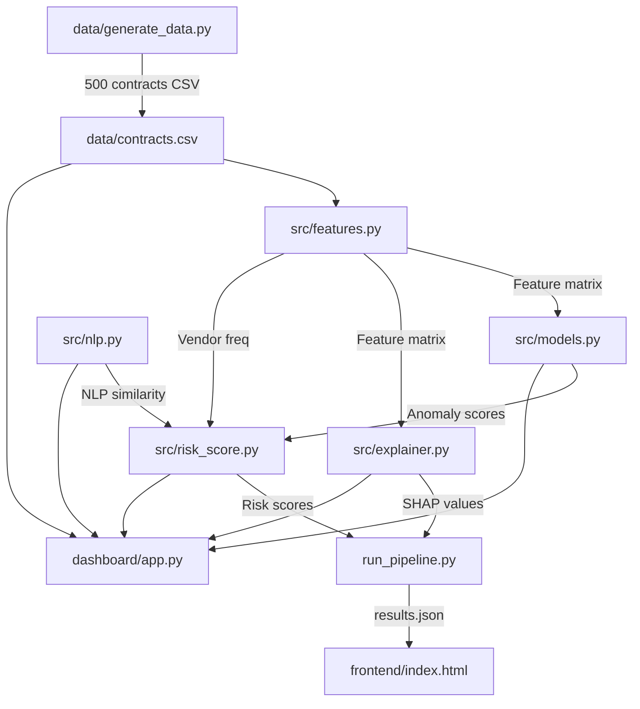

# Public Procurement Anomaly Detection — Walkthrough

## Overview
Built a complete AI-powered anomaly detection system for public procurement contracts with a premium frontend dashboard.

## Architecture



## What Was Built

### ML Pipeline (`src/`)

| Module | Purpose |
|--------|---------|
| [features.py](file:///c:/Users/Ayush/Desktop/MLProjects/public-procurement-anomaly-detection/src/features.py) | Vendor frequency, amount z-scores, days since last contract, dept ratios, categorical encoding, standard scaling |
| [models.py](file:///c:/Users/Ayush/Desktop/MLProjects/public-procurement-anomaly-detection/src/models.py) | Isolation Forest + One-Class SVM ensemble with union-based anomaly flagging |
| [nlp.py](file:///c:/Users/Ayush/Desktop/MLProjects/public-procurement-anomaly-detection/src/nlp.py) | TF-IDF vectorization + cosine similarity for detecting duplicate tender descriptions |
| [risk_score.py](file:///c:/Users/Ayush/Desktop/MLProjects/public-procurement-anomaly-detection/src/risk_score.py) | Weighted fusion: 50% anomaly + 30% NLP + 20% vendor freq, normalized to 0–100 |
| [explainer.py](file:///c:/Users/Ayush/Desktop/MLProjects/public-procurement-anomaly-detection/src/explainer.py) | SHAP TreeExplainer for per-contract and global feature importance |

### Data Generation
- [generate_data.py](file:///c:/Users/Ayush/Desktop/MLProjects/public-procurement-anomaly-detection/data/generate_data.py) — 500 synthetic procurement records (450 normal + 50 anomalous) with injected anomalies: inflated amounts, suspicious vendors, duplicate descriptions, rapid-fire awards

### Pipeline Runner
- [run_pipeline.py](file:///c:/Users/Ayush/Desktop/MLProjects/public-procurement-anomaly-detection/run_pipeline.py) — Runs the full ML pipeline and exports `frontend/results.json`

### Streamlit Dashboard
- [dashboard/app.py](file:///c:/Users/Ayush/Desktop/MLProjects/public-procurement-anomaly-detection/dashboard/app.py) — Interactive Streamlit app with Plotly charts, SHAP explorer, filterable tables

### Standalone Frontend Dashboard
- [index.html](file:///c:/Users/Ayush/Desktop/MLProjects/public-procurement-anomaly-detection/frontend/index.html) — Premium dark-themed HTML page
- [styles.css](file:///c:/Users/Ayush/Desktop/MLProjects/public-procurement-anomaly-detection/frontend/styles.css) — Glassmorphism, gradient cards, animations, full responsive design
- [app.js](file:///c:/Users/Ayush/Desktop/MLProjects/public-procurement-anomaly-detection/frontend/app.js) — Chart.js visualizations, interactive table with search/filter/sort/pagination, animated KPIs, particle background

## Results (Pipeline Output)

| Metric | Value |
|--------|-------|
| Total Contracts | 500 |
| Anomalies Detected | 66 |
| High Risk Contracts | 14 |
| Average Risk Score | 41.9 |
| Anomaly Rate | 13.2% |

## Verification

### Pipeline Execution
- ✅ `data/generate_data.py` — Generated 500 contracts successfully
- ✅ `run_pipeline.py` — Full ML pipeline completed, exported `results.json` (256KB)

### Frontend Dashboard
- ✅ All KPI cards render with animated counters
- ✅ Risk Score Distribution chart (Chart.js bar chart with gradient colors)
- ✅ Anomalies by Department chart (horizontal bar chart)
- ✅ SHAP Feature Importance chart
- ✅ Top Risky Vendors list with risk scores
- ✅ Interactive contracts table with search, filter, sort, and pagination
- ✅ Risk Score Formula section
- ✅ Animated particle background, glassmorphism cards, responsive layout

### Browser Recording


## How to Run

```bash
# 1. Generate synthetic data
python data/generate_data.py

# 2. Run ML pipeline & export results
python run_pipeline.py

# 3a. View Streamlit dashboard
streamlit run dashboard/app.py

# 3b. View standalone frontend (needs HTTP server)
cd frontend && python -m http.server 8080
# Then open http://localhost:8080
```

> [!IMPORTANT]
> The standalone frontend requires an HTTP server — opening `index.html` directly via `file://` will fail to load `results.json` due to browser CORS restrictions.
